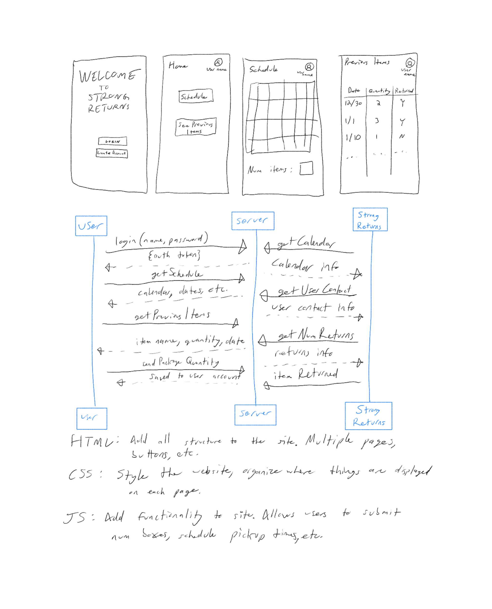

# startup
Repository for CS260 Winter 2024

# Startup Spec Assignment
## Elevator Pitch
For years, consumers all around the world have benefited from massive changes to the package delivery system. Amazon in particular revolutionized the industry, allowing consumers to 
get products the same day they found them online. Huge profit and consumer benefit was generated. Before long, other companies begain improving their delivery systems too. Getting 
packages delivered to your hosue is no longer a problem. Now, perhaps an even more tedious problem confronts the consumer - returns. Simply put, shopping is fun, returns are not. 
There is a massive need for consumers to be able to return their packages as quickly, efficiently, and easily as they purchased them. This is where Strong Returns comes in. Strong 
Returns connects a customer with a Strong Returns verified driver who will return packages for the customer. Simply logon, say how many boxes you have, and Strong Returns will take 
care of it for you.

## Key Features
Login feature. Users will be able to create accounts that will let them track their previous returns and status on current packages being returned.
Schedule. Users will use this to schedule when they would like for a driver to pick up their returns (or even select pick up ASAP!).
Previous items. Users will be able to see a clear history of every package they have ever returned with Strong Returns. 

**HTML** 
- Basic structural and organizational elements

**CSS** 
- Styling and animating

**JavaScript** 
- Interactivity. Buttons to login, create account, select a date, box quantity, etc will all be accomplished via JS.

**Web service** 
- When a user schedules a pickup, the web service will process this information, update the database, and send a confirmation notification.

**Authentication** 
- Users will be able to create accounts and log in

**Database persistence** 
- Storing user data in a database. Users will be able to see what packages they have returned, which packages are in process of being returned, and overall number of packages returned.

**WebSocket** 
- Will update the user's dashboard in real time. For example, if the status of a package changes (like from 'scheduled for pickup' to 'in transit'), the dashboard will reflect this change immediately

**Web framework** 
- React will allow UI to be dynamic and responsive. Login forms, package scheduling, and user dashboards will be interactive and update in real-time

